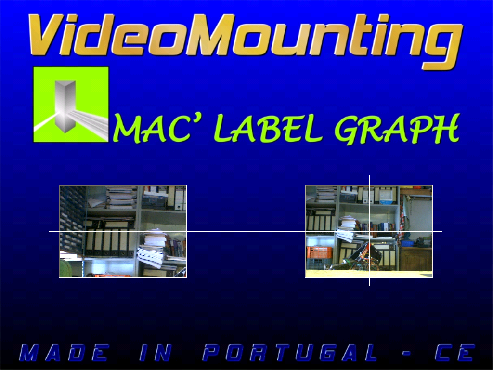
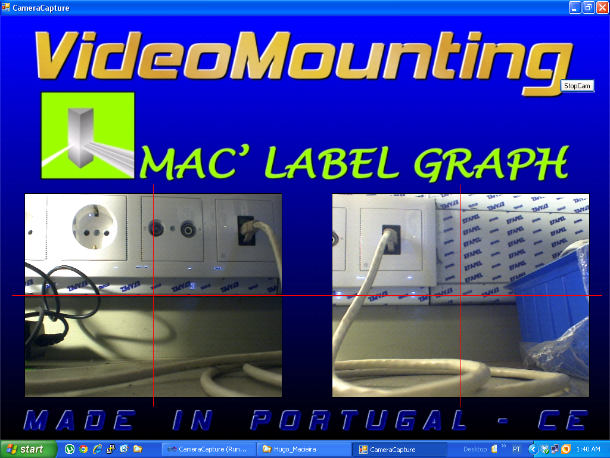
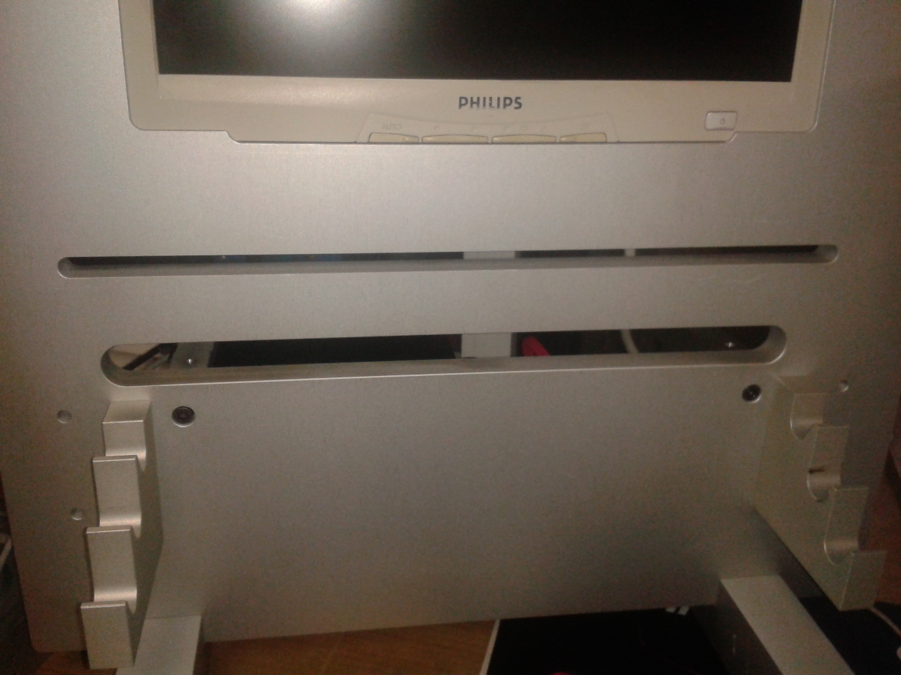

## Synopsis

System for visual aligment of the printing gravures to the rolling drum.  
The user aligns the gravure acording to engraved feature and the lines on the image to  
ensure that the gravure is centered.

## Software

The camera intrinsic parameters are used to correct the lens distorsion.
Allows user to reverse the image, make zoom on center and contrast enhacement.

## Dependencies
Emgu CV
 

## Videos/Images

GUI.  

GIU with different zoom.  

Front view.  

## Contributors

Main Developer :HSO  
Email: hugo(dot)soares(at)fe(dot)up(dot)pt
